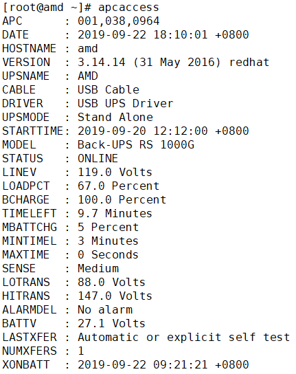
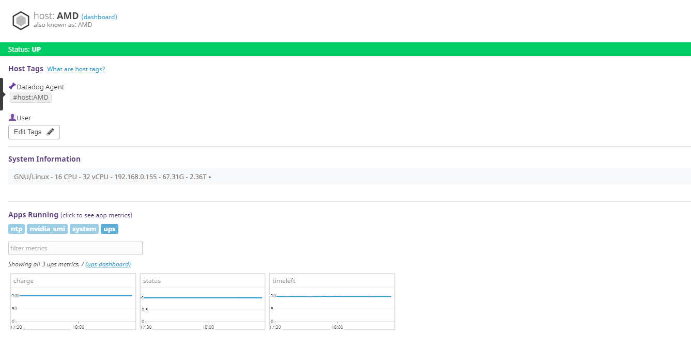

# datadogdog-apcaccess

對於apc品牌的UPS，可以透過apcaccess將UPS電量、狀態、剩餘使用時間回報到datadog上

## 原理

使用python套件[plumbum](https://plumbum.readthedocs.io/en/latest/)與linux shell互動，讀取數據並交給datadog-agent，再回傳

## 需求

首先確認UPS已與電腦連接，安裝apcupsd，對於apcupsd管理ups的設定這裡不多做說明，請看[這裡](http://blog.crboy.net/2011/03/linuxapc-ups-apcupsd.html)

```
yum install apcupsd
```

於linux shell 中，輸入apcaccess有資訊出現，即代表安裝成功




而此外掛透過[plumbum](https://plumbum.readthedocs.io/en/latest/)與linux shell互動，抓取溫度資料，所以需在datadog的python資料夾中安裝plumbum

```
/opt/datadog-agent/embedded/bin/pip install plumbum
```

## 安裝教學

* 複製下列兩個檔案到datadog-agent目錄中

  ```
  cp ups.yaml /etc/datadog-agent/conf.d/
  cp ups.py /etc/datadog-agent/checks.d/
  ```

* 更改兩個檔案的所有者為dd-agent

  ```
  chown -R dd-agent:dd-agent /etc/datadog-agent
  ```

* 重新啟動datadog-agent

  ```
  systemctl restart datadog-agent
  ```

* 測試

  ```
  datadog-agent check ups
  ```

  出現ok字樣即安裝成功，稍待幾分鐘即可於datadog平台得到資料

## 演示

charge為電量，以百分比表示

status為狀態，1為目前未斷電，0為已斷電，由ups供電

timeleft為ups剩餘使用時間


apcaccess也可以傳其他參數，請看[官方說明文件](http://www.apcupsd.org/manual/)


這樣的做法可以把很多東西傳到datadog，我也有做傳cpu溫度資料的[datadog-sensors](https://github.com/allmwh/datadog-sensors)，ups資料也有[datadog-nvidiasmi](https://github.com/allmwh/datadog-nvidiasmi)

